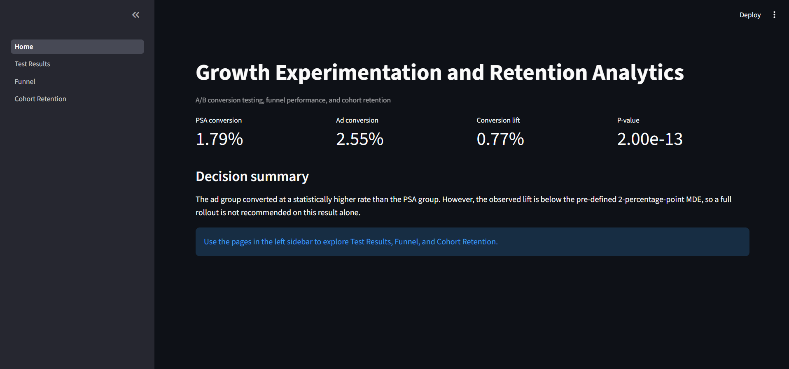
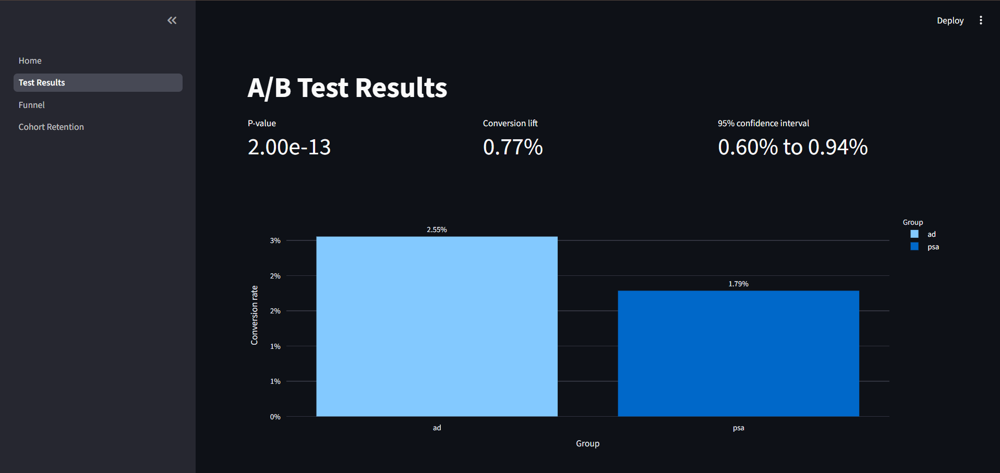
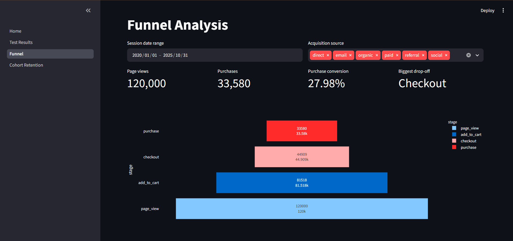
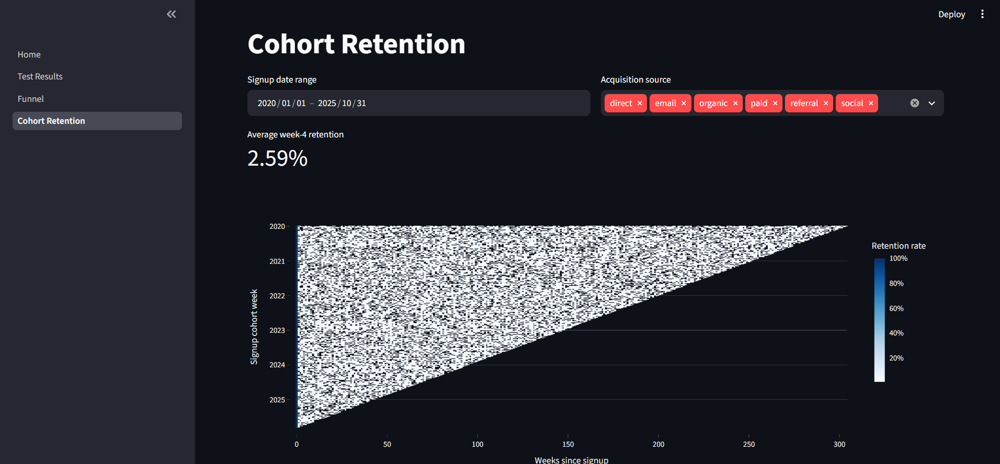

# Growth Experimentation & Retention Analytics

[](YOUR-STREAMLIT-LINK)
[](https://www.python.org/)
[](https://streamlit.io/)
[](YOUR-STREAMLIT-LINK)

> **Live dashboard:** https://growth-experimentation-retention-analytics-09.streamlit.app/

## Executive recommendation

Do not fully roll out the regular-ad experience yet. The ad treatment increased conversion from **1.79%** to **2.55%**, producing an absolute lift of **0.77 percentage points** and a relative lift of approximately **43%**. The result is statistically significant, but it does not meet the pre-defined **2-percentage-point minimum detectable effect (MDE)** required for rollout. The recommended next step is a follow-up experiment that includes revenue, customer-acquisition cost, and downstream retention guardrails.

---

## Dashboard preview

<table>
  <tr>
    <td width="50%">
      
      <p align="center"><b>Overview</b><br/>Executive metrics and business recommendation</p>
    </td>
    <td width="50%">
      
      <p align="center"><b>A/B Test Results</b><br/>Lift, p-value, and confidence interval</p>
    </td>
  </tr>
  <tr>
    <td width="50%">
      
      <p align="center"><b>Funnel Analysis</b><br/>Stage-level drop-off with interactive filters</p>
    </td>
    <td width="50%">
      
      <p align="center"><b>Cohort Retention</b><br/>Signup cohorts segmented by acquisition source</p>
    </td>
  </tr>
</table>

---

## Business question

**Does showing a regular advertisement instead of a public-service announcement increase conversion enough to justify a production rollout?**

This project combines experimental analysis, funnel diagnostics, and cohort-retention exploration in a deployed Streamlit application.

## Key A/B test results

| Metric | Result |
|---|---:|
| PSA control conversion rate | 1.79% |
| Ad treatment conversion rate | 2.55% |
| Absolute conversion lift | +0.77 percentage points |
| Relative conversion lift | +43% |
| 95% confidence interval | +0.60 to +0.94 percentage points |
| P-value | < 0.001 |
| Practical threshold / MDE | +2.00 percentage points |
| Decision | Do not fully roll out yet |

### Interpretation

The chi-square test shows strong statistical evidence that conversion differs between the ad and PSA groups. However, statistical significance is not sufficient for a business decision. The entire confidence interval remains below the defined two-percentage-point MDE, so the observed uplift is not practically significant under the project’s rollout rule.

## Funnel and retention findings

| Funnel metric | Result |
|---|---:|
| Page-view sessions | 120,000 |
| Purchase sessions | 33,580 |
| End-to-end purchase conversion | 27.98% |
| Largest funnel friction point | Checkout |
| Average week-4 retention | 2.59% |

The funnel and cohort pages include date-range and acquisition-source filters so users can investigate whether performance varies by channel.

## Methodology

### Experiment analysis

The primary outcome is binary conversion. The project uses a chi-square test of independence to compare conversion outcomes between the `ad` treatment group and `psa` control group.

The experiment analysis reports:

- Conversion rate by group
- P-value from the chi-square test
- Absolute conversion-rate lift
- 95% confidence interval
- Minimum detectable effect
- Statistical and practical-significance decision

### Funnel analysis

The funnel measures unique sessions across four stages:

```text
Page View → Add to Cart → Checkout → Purchase